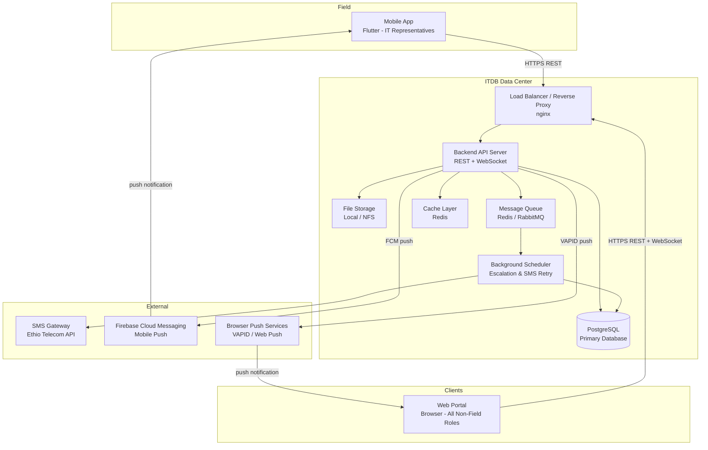
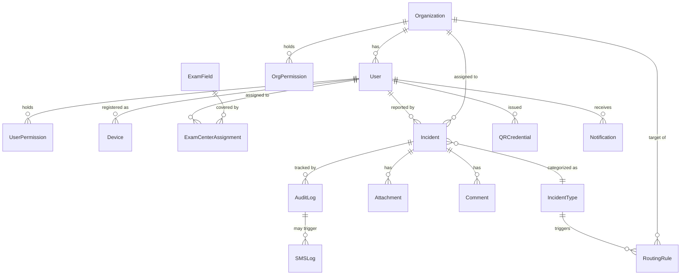

# Design Document: Exam Incident & Support Portal

## Overview

The Exam Incident & Support Portal is an on-premises, multi-tenant incident management system for national exam operations in Addis Ababa. It replaces ad-hoc phone and Telegram-based reporting with a structured digital workflow connecting 80–100 exam fields to ITDB, MoE, AA Education Bureau, Ethio Telecom, ELPA, Security Police, and any future participating organizations.

The system consists of two runtime components:

- **Mobile App** — A Flutter (Dart) application used exclusively by IT Representatives in the field. It operates offline-first, stores incidents locally when offline, and syncs automatically when connectivity is restored. Access is gated by Device ID verification. Push notifications are delivered via Firebase Cloud Messaging (FCM).
- **Web Portal** — A single browser-based application serving all non-field roles. Role and organization determine what each user sees and can do. Deployed at a single URL.

Both components communicate with a central backend server deployed on-premises at the ITDB data center. There is no dependency on external cloud services.

### Key Design Principles

- **Offline-first mobile**: Field conditions are unreliable. The mobile app must function fully without connectivity and sync transparently when online.
- **Two-level permission enforcement**: Every action is checked against both the organization's permission set and the individual user's permission set. The user's set must be a strict subset of the organization's.
- **Dynamic configuration over code changes**: Organizations, incident types, routing rules, and permissions are runtime data. Adding a new organization or incident type requires no deployment.
- **Append-only audit trail**: Every state change is recorded immutably. No role, including Super Admin, can modify or delete audit entries.
- **On-premises deployment**: All data stays within the ITDB data center. No external cloud APIs except the SMS gateway.

---

## Architecture

### High-Level Architecture



### Component Responsibilities

| Component | Technology | Responsibility |
|---|---|---|
| Mobile App | Flutter (Dart), sqflite/drift, dio | Offline incident capture, Device ID auth, QR display, sync, FCM push |
| Web Portal | React (TypeScript), WebSocket client | Role-scoped UI, incident management, dashboards, QR scan, Web Push |
| Backend API | Node.js / Express (or Java Spring Boot) | REST API, WebSocket push, auth, permission enforcement, push dispatch |
| PostgreSQL | PostgreSQL 15+ | All persistent data: incidents, users, orgs, audit log, push tokens |
| Redis | Redis 7+ | Session cache, real-time pub/sub for WebSocket, job queue |
| File Storage | Local filesystem / NFS mount | Incident photo and video attachments |
| Background Scheduler | Node.js cron / Celery | Escalation timers, SMS retry, periodic sync jobs |
| SMS Gateway | HTTP integration | Outbound SMS alerts to officials |
| FCM | Firebase Cloud Messaging | Mobile push notifications to Flutter app |
| Web Push (VAPID) | Browser Push API | Browser push notifications to Web Portal |
| Load Balancer | nginx | TLS termination, reverse proxy, static asset serving |

### Deployment Topology

```mermaid
graph LR
    subgraph Server Hardware - ITDB Data Center
        nginx[nginx\nPort 443]
        app[App Server\nPort 3000]
        pg[PostgreSQL\nPort 5432]
        redis[Redis\nPort 6379]
        fs[/data/attachments\nNFS or local disk]
    end

    nginx --> app
    app --> pg
    app --> redis
    app --> fs
```

A single-server deployment handles the stated load (100 concurrent mobile + 50 concurrent web users). The architecture supports horizontal scaling of the app tier behind nginx if needed in future exam cycles.

---

## Components and Interfaces

### Backend API — Module Structure

```
src/
  auth/           # JWT issuance, Device ID verification, session management
  organizations/  # Org CRUD, Org_Permission_Set management
  users/          # User CRUD, User_Permission_Set management
  incidents/      # Incident lifecycle, assignment, escalation
  audit/          # Append-only audit log writes and queries
  catalog/        # Incident_Type_Catalog management
  routing/        # Routing_Rule management and evaluation
  qr/             # QR credential generation, signing, verification
  devices/        # Device registration and deactivation
  notifications/  # In-app notifications, SMS dispatch
  push/           # PushNotificationService: FCM + VAPID Web Push dispatch, token registry
  reports/        # Report generation, PDF/XLSX export
  sync/           # Mobile sync endpoint (catalog, assignments, notifications)
  websocket/      # Real-time push to Web Portal clients
  middleware/
    auth.ts       # JWT validation
    permission.ts # Two-level permission check
    audit.ts      # Automatic audit log injection
```

### Permission Enforcement Middleware

Every protected API route passes through the permission middleware before the handler executes:

```
Request → JWT Validation → Load User + Org → Check User_Permission_Set ∩ Org_Permission_Set → Handler
```

The middleware rejects the request with HTTP 403 if the required permission is absent from either set. This is the single enforcement point — no handler performs its own permission check.

### Mobile App — Module Structure

```
lib/
  auth/           # Device ID registration, JWT storage (flutter_secure_storage)
  incidents/      # Incident form, local sqflite/drift DB, sync manager
  qr/             # QR credential display (qr_flutter, offline)
  sync/           # Background sync service (workmanager), exponential back-off
  profile/        # IT Rep profile, assigned exam fields
  notifications/  # FCM push handling (firebase_messaging, flutter_local_notifications)
  db/             # drift table definitions and DAOs
```

### Web Portal — Module Structure

```
src/
  auth/           # Login, session, permission context, push permission request
  incidents/      # Incident list, detail, status update, assignment
  dashboard/      # Bureau Staff real-time table, GIS map
  monitoring/     # MoE / AA Education Bureau live dashboard
  admin/
    organizations/  # Org management (Super Admin)
    users/          # User management
    devices/        # Device registry
    catalog/        # Incident type catalog
    routing/        # Routing rules
    permissions/    # Org and user permission assignment
  reports/        # Report generation and export
  qr/             # QR scan interface
  notifications/  # In-app notification panel
  push/           # Service Worker registration, Web Push subscription management
```

### REST API Endpoints (Key Routes)

```
POST   /api/auth/login
POST   /api/auth/device-verify

GET    /api/incidents                    # filtered list
POST   /api/incidents                    # create (mobile)
GET    /api/incidents/:id
PATCH  /api/incidents/:id/status
PATCH  /api/incidents/:id/assign
POST   /api/incidents/:id/comments
POST   /api/incidents/:id/attachments
POST   /api/incidents/:id/escalate
POST   /api/incidents/:id/sms-alert

GET    /api/organizations
POST   /api/organizations
PATCH  /api/organizations/:id
PATCH  /api/organizations/:id/permissions

GET    /api/users
POST   /api/users
PATCH  /api/users/:id
PATCH  /api/users/:id/permissions

GET    /api/devices
POST   /api/devices
PATCH  /api/devices/:id/deactivate

GET    /api/catalog/incident-types
POST   /api/catalog/incident-types
PATCH  /api/catalog/incident-types/:id

GET    /api/routing-rules
POST   /api/routing-rules
PATCH  /api/routing-rules/:id
DELETE /api/routing-rules/:id

GET    /api/qr/:userId
POST   /api/qr/verify

GET    /api/audit-log
GET    /api/audit-log/incident/:id

GET    /api/reports/generate
GET    /api/reports/export/:format

GET    /api/sync/mobile          # catalog + assignments + notifications for device

POST   /api/push/register        # register FCM token or Web Push subscription
DELETE /api/push/unregister      # remove push token/subscription for a device
```

### WebSocket Events (Server → Client)

```
incident.created          { incident }
incident.status_changed   { incidentId, newStatus, actor }
incident.assigned         { incidentId, assignedBody }
incident.escalated        { incidentId, reason }
notification.new          { notificationId, message }
```

### Push Notification Events

Push notifications are sent for all incident actions to both Web Portal (VAPID/Web Push) and Flutter mobile (FCM). They are delivered to users who are offline or have the app in the background/terminated state.

| Trigger | Recipients | Channel |
|---|---|---|
| Incident created | All ITDB Bureau Staff | FCM + Web Push |
| Incident assigned to org | All users of that org | FCM + Web Push |
| Incident assigned to specific user | That user | FCM + Web Push |
| Status changed to In-Progress | Reporter IT Rep + assigned body | FCM + Web Push |
| Incident resolved | Reporter IT Rep + assigned body | FCM + Web Push |
| Incident escalated | New assigned body + MoE | FCM + Web Push |
| Comment added | All parties involved in the incident | FCM + Web Push |
| Automatic escalation triggered | MoE + Bureau Staff | FCM + Web Push |
| High-priority incident created | All Bureau Staff | FCM + Web Push (immediate) |

Push delivery failures are logged but do not block the primary action. On-premises deployment note: FCM requires outbound internet access to Google's FCM servers; VAPID Web Push requires outbound access to browser push services. These are the only external dependencies added beyond the SMS gateway.

---

## Data Models

### Entity Relationship Overview



### Core Table Definitions

```sql
-- Organizations
CREATE TABLE organizations (
    id            UUID PRIMARY KEY DEFAULT gen_random_uuid(),
    name          VARCHAR(255) NOT NULL UNIQUE,
    type          VARCHAR(100) NOT NULL,
    is_active     BOOLEAN NOT NULL DEFAULT TRUE,
    created_at    TIMESTAMPTZ NOT NULL DEFAULT NOW(),
    updated_at    TIMESTAMPTZ NOT NULL DEFAULT NOW()
);

-- System-defined permissions (seed data, not user-editable)
-- ~35 granular permissions across 11 groups (group is stored as a column for UI grouping only)
CREATE TABLE permissions (
    id    SERIAL PRIMARY KEY,
    name  VARCHAR(100) NOT NULL UNIQUE,  -- e.g. 'incidents.view', 'users.create'
    group_name VARCHAR(100) NOT NULL     -- e.g. 'Incidents', 'Users' — UI label only, not enforced
);

-- Org-level permission grants
CREATE TABLE org_permissions (
    org_id         UUID NOT NULL REFERENCES organizations(id),
    permission_id  INT  NOT NULL REFERENCES permissions(id),
    PRIMARY KEY (org_id, permission_id)
);

-- Users
CREATE TABLE users (
    id              UUID PRIMARY KEY DEFAULT gen_random_uuid(),
    org_id          UUID NOT NULL REFERENCES organizations(id),
    name            VARCHAR(255) NOT NULL,
    email           VARCHAR(255) UNIQUE,
    password_hash   VARCHAR(255),
    role            VARCHAR(50) NOT NULL,  -- 'super_admin','org_admin','bureau_staff','it_rep','moe','aa_edu','external'
    is_active       BOOLEAN NOT NULL DEFAULT TRUE,
    phone_number    VARCHAR(30),
    created_at      TIMESTAMPTZ NOT NULL DEFAULT NOW(),
    updated_at      TIMESTAMPTZ NOT NULL DEFAULT NOW()
);

-- User-level permission grants
CREATE TABLE user_permissions (
    user_id        UUID NOT NULL REFERENCES users(id),
    permission_id  INT  NOT NULL REFERENCES permissions(id),
    PRIMARY KEY (user_id, permission_id)
);

-- Devices (IT Representatives)
CREATE TABLE devices (
    id              UUID PRIMARY KEY DEFAULT gen_random_uuid(),
    device_id       VARCHAR(255) NOT NULL UNIQUE,  -- hardware identifier
    user_id         UUID UNIQUE REFERENCES users(id),
    is_active       BOOLEAN NOT NULL DEFAULT TRUE,
    registered_at   TIMESTAMPTZ NOT NULL DEFAULT NOW(),
    last_seen_at    TIMESTAMPTZ
);

-- Exam Fields
CREATE TABLE exam_fields (
    id        UUID PRIMARY KEY DEFAULT gen_random_uuid(),
    name      VARCHAR(255) NOT NULL UNIQUE,
    location  VARCHAR(500),
    latitude  DECIMAL(9,6),
    longitude DECIMAL(9,6),
    is_active BOOLEAN NOT NULL DEFAULT TRUE
);

-- Exam Center Assignments
CREATE TABLE exam_center_assignments (
    id            UUID PRIMARY KEY DEFAULT gen_random_uuid(),
    user_id       UUID NOT NULL REFERENCES users(id),
    exam_field_id UUID NOT NULL REFERENCES exam_fields(id),
    assigned_at   TIMESTAMPTZ NOT NULL DEFAULT NOW(),
    UNIQUE (user_id, exam_field_id)
);

-- Incident Type Catalog
CREATE TABLE incident_types (
    id               UUID PRIMARY KEY DEFAULT gen_random_uuid(),
    name             VARCHAR(255) NOT NULL UNIQUE,
    default_priority VARCHAR(10) NOT NULL CHECK (default_priority IN ('Low','Medium','High')),
    description      TEXT,
    is_active        BOOLEAN NOT NULL DEFAULT TRUE,
    created_at       TIMESTAMPTZ NOT NULL DEFAULT NOW(),
    updated_at       TIMESTAMPTZ NOT NULL DEFAULT NOW()
);

-- Routing Rules
CREATE TABLE routing_rules (
    id                  UUID PRIMARY KEY DEFAULT gen_random_uuid(),
    incident_type_id    UUID NOT NULL REFERENCES incident_types(id),
    target_org_id       UUID REFERENCES organizations(id),
    target_user_id      UUID REFERENCES users(id),
    auto_assign         BOOLEAN NOT NULL DEFAULT FALSE,
    is_active           BOOLEAN NOT NULL DEFAULT TRUE,
    created_at          TIMESTAMPTZ NOT NULL DEFAULT NOW(),
    updated_at          TIMESTAMPTZ NOT NULL DEFAULT NOW(),
    CHECK (target_org_id IS NOT NULL OR target_user_id IS NOT NULL)
);

-- Incidents
CREATE TABLE incidents (
    id                  UUID PRIMARY KEY DEFAULT gen_random_uuid(),
    exam_field_id       UUID NOT NULL REFERENCES exam_fields(id),
    incident_type_id    UUID NOT NULL REFERENCES incident_types(id),
    reported_by_user_id UUID NOT NULL REFERENCES users(id),
    device_id           UUID REFERENCES devices(id),
    priority            VARCHAR(10) NOT NULL CHECK (priority IN ('Low','Medium','High')),
    status              VARCHAR(20) NOT NULL DEFAULT 'Reported'
                            CHECK (status IN ('Reported','Assigned','In-Progress','Resolved')),
    description         TEXT,
    assigned_org_id     UUID REFERENCES organizations(id),
    assigned_user_id    UUID REFERENCES users(id),
    resolved_at         TIMESTAMPTZ,
    resolution_summary  TEXT,
    local_id            VARCHAR(255),  -- mobile-generated ID for dedup
    created_at          TIMESTAMPTZ NOT NULL DEFAULT NOW(),
    updated_at          TIMESTAMPTZ NOT NULL DEFAULT NOW()
);

CREATE INDEX idx_incidents_status       ON incidents(status);
CREATE INDEX idx_incidents_priority     ON incidents(priority);
CREATE INDEX idx_incidents_exam_field   ON incidents(exam_field_id);
CREATE INDEX idx_incidents_assigned_org ON incidents(assigned_org_id);
CREATE INDEX idx_incidents_created_at   ON incidents(created_at);

-- Attachments
CREATE TABLE attachments (
    id           UUID PRIMARY KEY DEFAULT gen_random_uuid(),
    incident_id  UUID NOT NULL REFERENCES incidents(id),
    file_path    VARCHAR(500) NOT NULL,
    file_type    VARCHAR(50),  -- 'photo', 'video', 'document'
    file_size    BIGINT,
    uploaded_by  UUID NOT NULL REFERENCES users(id),
    uploaded_at  TIMESTAMPTZ NOT NULL DEFAULT NOW()
);

-- Comments
CREATE TABLE comments (
    id           UUID PRIMARY KEY DEFAULT gen_random_uuid(),
    incident_id  UUID NOT NULL REFERENCES incidents(id),
    author_id    UUID NOT NULL REFERENCES users(id),
    body         TEXT NOT NULL,
    created_at   TIMESTAMPTZ NOT NULL DEFAULT NOW()
);

-- Audit Log (append-only)
CREATE TABLE audit_log (
    id              BIGSERIAL PRIMARY KEY,
    incident_id     UUID REFERENCES incidents(id),
    actor_user_id   UUID NOT NULL REFERENCES users(id),
    actor_role      VARCHAR(50) NOT NULL,
    actor_org_id    UUID NOT NULL REFERENCES organizations(id),
    device_id       VARCHAR(255),
    action_type     VARCHAR(100) NOT NULL,
    field_changed   VARCHAR(100),
    previous_value  TEXT,
    new_value       TEXT,
    routing_rule_id UUID REFERENCES routing_rules(id),
    occurred_at     TIMESTAMPTZ NOT NULL DEFAULT NOW()
);

CREATE INDEX idx_audit_incident   ON audit_log(incident_id);
CREATE INDEX idx_audit_actor      ON audit_log(actor_user_id);
CREATE INDEX idx_audit_occurred   ON audit_log(occurred_at);
CREATE INDEX idx_audit_action     ON audit_log(action_type);

-- Prevent UPDATE and DELETE on audit_log via trigger
CREATE RULE audit_log_no_update AS ON UPDATE TO audit_log DO INSTEAD NOTHING;
CREATE RULE audit_log_no_delete AS ON DELETE TO audit_log DO INSTEAD NOTHING;

-- QR Credentials
CREATE TABLE qr_credentials (
    id           UUID PRIMARY KEY DEFAULT gen_random_uuid(),
    user_id      UUID NOT NULL REFERENCES users(id),
    payload      TEXT NOT NULL,       -- base64-encoded signed payload
    signature    TEXT NOT NULL,       -- ECDSA signature (hex)
    is_valid     BOOLEAN NOT NULL DEFAULT TRUE,
    issued_at    TIMESTAMPTZ NOT NULL DEFAULT NOW(),
    invalidated_at TIMESTAMPTZ
);

-- Notifications
CREATE TABLE notifications (
    id           UUID PRIMARY KEY DEFAULT gen_random_uuid(),
    user_id      UUID NOT NULL REFERENCES users(id),
    incident_id  UUID REFERENCES incidents(id),
    message      TEXT NOT NULL,
    is_read      BOOLEAN NOT NULL DEFAULT FALSE,
    created_at   TIMESTAMPTZ NOT NULL DEFAULT NOW()
);

-- SMS Log
CREATE TABLE sms_log (
    id              UUID PRIMARY KEY DEFAULT gen_random_uuid(),
    incident_id     UUID REFERENCES incidents(id),
    recipient_phone VARCHAR(30) NOT NULL,
    message_body    TEXT NOT NULL,
    status          VARCHAR(20) NOT NULL DEFAULT 'pending',  -- 'pending','sent','failed'
    attempt_count   INT NOT NULL DEFAULT 0,
    last_attempt_at TIMESTAMPTZ,
    sent_at         TIMESTAMPTZ,
    created_at      TIMESTAMPTZ NOT NULL DEFAULT NOW()
);

-- Push Tokens (FCM for Flutter mobile, Web Push subscriptions for browser)
CREATE TABLE push_tokens (
    id            UUID PRIMARY KEY DEFAULT gen_random_uuid(),
    user_id       UUID NOT NULL REFERENCES users(id),
    token_type    VARCHAR(20) NOT NULL CHECK (token_type IN ('fcm', 'web_push')),
    token         TEXT NOT NULL,          -- FCM registration token or Web Push subscription JSON
    device_id     VARCHAR(255),           -- hardware device ID for mobile tokens
    created_at    TIMESTAMPTZ NOT NULL DEFAULT NOW(),
    last_used_at  TIMESTAMPTZ,
    UNIQUE (user_id, token_type, device_id)
);

CREATE INDEX idx_push_tokens_user ON push_tokens(user_id);
```

### Mobile App Local Database (drift / sqflite)

```dart
// Mirrors the server incident schema for offline storage
// Using drift (formerly moor) table definitions

class LocalIncidents extends Table {
  TextColumn get localId => text()();          // UUID generated on device
  TextColumn get examFieldId => text()();
  TextColumn get incidentTypeId => text()();
  TextColumn get priority => text()();
  TextColumn get description => text().nullable()();
  TextColumn get status => text().withDefault(const Constant('Reported'))();
  TextColumn get syncStatus => text().withDefault(const Constant('Pending'))(); // "Pending" | "Synced"
  IntColumn get retryCount => integer().withDefault(const Constant(0))();
  IntColumn get createdAt => integer()();      // Unix timestamp (ms)
  IntColumn get syncedAt => integer().nullable()();

  @override
  Set<Column> get primaryKey => {localId};
}

class LocalAttachments extends Table {
  TextColumn get id => text()();
  TextColumn get incidentLocalId => text()();
  TextColumn get localFilePath => text()();
  TextColumn get fileType => text()();
  TextColumn get syncStatus => text().withDefault(const Constant('Pending'))();

  @override
  Set<Column> get primaryKey => {id};
}

class CatalogCache extends Table {
  TextColumn get id => text()();
  TextColumn get name => text()();
  TextColumn get defaultPriority => text()();
  BoolColumn get isActive => boolean()();
  IntColumn get cachedAt => integer()();

  @override
  Set<Column> get primaryKey => {id};
}

class NotificationsCache extends Table {
  TextColumn get id => text()();
  TextColumn get incidentId => text().nullable()();
  TextColumn get message => text()();
  BoolColumn get isRead => boolean().withDefault(const Constant(false))();
  IntColumn get createdAt => integer()();

  @override
  Set<Column> get primaryKey => {id};
}
```

### QR Credential Payload Structure

```json
{
  "version": 1,
  "userId": "uuid",
  "name": "Full Name",
  "role": "it_rep",
  "orgId": "uuid",
  "orgName": "ITDB",
  "examFieldIds": ["uuid1", "uuid2"],
  "issuedAt": "2025-01-01T00:00:00Z",
  "credentialId": "uuid"
}
```

The payload is JSON-serialized, base64url-encoded, and signed with ECDSA (P-256). The public key is embedded in the Web Portal at build time for offline verification. When the account is deactivated or assignments change, the old credential's `is_valid` flag is set to false and a new credential is issued.

---

## Correctness Properties

*A property is a characteristic or behavior that should hold true across all valid executions of a system — essentially, a formal statement about what the system should do. Properties serve as the bridge between human-readable specifications and machine-verifiable correctness guarantees.*


### Property 1: Two-Level Permission Enforcement

*For any* user with permission set P_user belonging to an organization with permission set P_org, and for any action requiring permission P, the action SHALL be denied if P is absent from P_user OR absent from P_org, regardless of what the other set contains. The effective permission set is always P_user ∩ P_org.

**Validates: Requirements 1.6, 1.7, 13.8, 18.5**

### Property 2: Cascading Permission Removal

*For any* organization with N users, when a Super_Admin removes permission P from the organization's Org_Permission_Set, every user in that organization whose User_Permission_Set contained P SHALL have P removed from their User_Permission_Set, and the resulting User_Permission_Set for every user SHALL remain a subset of the updated Org_Permission_Set.

**Validates: Requirements 13.9, 18.7**

### Property 3: Incident Scoping by Organization

*For any* user belonging to an external organization (Ethio_Telecom, ELPA, Security_Police), the set of incidents returned by any query SHALL contain only incidents where the assigned_org_id matches that user's organization ID. No incident assigned to a different organization SHALL appear in their view.

**Validates: Requirements 1.3, 9.1**

### Property 4: Audit Log Completeness

*For any* state-changing action on an incident (creation, status change, assignment, reassignment, comment, attachment, escalation, resolution), an Audit_Log entry SHALL be created containing the actor's user ID, role, organization, the action type, the previous and new values of changed fields, and a UTC timestamp. No state-changing action SHALL complete without a corresponding audit entry.

**Validates: Requirements 6.6, 7.6, 7.9, 15.1, 15.2**

### Property 5: Automatic Escalation by Priority Threshold

*For any* incident with status "In-Progress", if the incident has priority "High" and remains unresolved for 30 or more minutes, OR has priority "Medium" and remains unresolved for 90 or more minutes, the system SHALL trigger an escalation to the MoE exam-coordination unit and send an SMS alert. The escalation SHALL be recorded in the Audit_Log with the trigger condition and timestamp.

**Validates: Requirements 7.7, 7.8, 7.9**

### Property 6: Read-Only Enforcement for Observer Roles

*For any* user with role MoE or AA_Education_Bureau, any attempt to create, update, assign, or delete an incident SHALL be denied with a 403 response, regardless of what permissions are configured in their User_Permission_Set.

**Validates: Requirements 1.4, 10.1**

### Property 7: QR Credential Sign-Verify Round Trip

*For any* valid QR credential payload (containing userId, name, role, orgId, examFieldIds, issuedAt, credentialId), signing the payload with the system's private key and then verifying the resulting signature with the corresponding public key SHALL return true. A payload with any field modified after signing SHALL fail verification.

**Validates: Requirements 4.7**

### Property 8: Offline Incident Storage and Retry

*For any* incident submitted by the Mobile_App when no network connection is available, the incident SHALL be stored in the local Room database with syncStatus = "Pending". When connectivity is restored, the app SHALL attempt to upload each Pending incident, incrementing the retry count on each failure, up to a maximum of 10 attempts, with exponentially increasing delays between attempts.

**Validates: Requirements 5.5, 5.6, 5.7**

### Property 9: Mobile Exam Field Scoping

*For any* registered device with exam center assignment A, the sync endpoint SHALL return exactly the exam fields in A — no more, no fewer. Any incident submission referencing an exam field not in A SHALL be rejected by the server.

**Validates: Requirements 3.3, 3.5**

### Property 10: Incident Initial State Invariant

*For any* incident successfully received by the central server, the initial status SHALL be "Reported" and the assigned_org SHALL be ITDB. No other initial status or assignment SHALL be possible through the normal submission path.

**Validates: Requirements 6.1**

### Property 11: Status Transition Forward-Only Invariant

*For any* incident in status S, and for any user without Super_Admin authorization, any attempt to transition the incident to a status that precedes S in the lifecycle order (Reported → Assigned → In-Progress → Resolved) SHALL be rejected. The status SHALL only move forward.

**Validates: Requirements 6.5**

### Property 12: Device ID Uniqueness

*For any* attempt to register or activate a Device_ID that is already associated with an active IT_Representative account, the operation SHALL be rejected. At all times, each Device_ID SHALL be associated with at most one active IT_Representative.

**Validates: Requirements 13.4**

### Property 13: Audit Log Immutability

*For any* existing Audit_Log entry, any attempt to update or delete that entry — regardless of the actor's role, including Super_Admin — SHALL be rejected. The audit log is append-only.

**Validates: Requirements 15.5**

### Property 14: Inactive Incident Types Excluded from Mobile Catalog

*For any* incident type with is_active = false, the mobile sync endpoint SHALL not include that type in the catalog response. *For any* incident type with is_active = true, it SHALL appear in the catalog response. The mobile catalog at any point in time SHALL contain exactly the set of active incident types.

**Validates: Requirements 19.5, 19.6**

### Property 15: Incident Type Deletion Referential Integrity

*For any* incident type that is referenced by at least one existing Routing_Rule or at least one historical incident, any attempt to delete that incident type SHALL be rejected with a validation error listing the conflicting references. The incident type SHALL remain in the catalog until all references are removed or the type is set to inactive instead.

**Validates: Requirements 19.7**

### Property 16: SMS Delivery Retry Bounded

*For any* SMS send attempt that receives a delivery failure from the SMS_Gateway, the system SHALL retry delivery up to 3 times at 60-second intervals. After 3 failed attempts, no further retries SHALL occur. Each attempt SHALL be recorded in the Audit_Log with the recipient, message, timestamp, and delivery status.

**Validates: Requirements 12.5, 12.4**

### Property 17: Organization Permission Set Round-Trip

*For any* subset S of the ~35 system-defined permissions, assigning S as an organization's Org_Permission_Set and then reading back that organization's permissions SHALL return exactly S — no more, no fewer permissions.

**Validates: Requirements 2.3, 18.2**

### Property 18: Routing Rule Pre-Population

*For any* incident type T that has an active Routing_Rule mapping it to a target Assigned_Body B, when a Bureau_Staff member opens a newly received incident of type T for triage, the assignment field SHALL be pre-populated with B. If no routing rule exists for T, the assignment field SHALL be empty.

**Validates: Requirements 17.2**

### Property 19: Default Priority Pre-Fill

*For any* active incident type with default_priority D, when an IT_Representative selects that incident type in the incident reporting form, the priority field SHALL be pre-filled with D. The IT_Representative MAY override this value before submission.

**Validates: Requirements 5.2**

### Property 20: Organization Deactivation Revokes Sessions

*For any* organization with N active user sessions, deactivating that organization SHALL invalidate all N sessions within the session TTL window, and any subsequent authenticated request using those session tokens SHALL be rejected with 401. New login attempts for users of that organization SHALL be rejected until the organization is reactivated.

**Validates: Requirements 2.7**

---

## Error Handling

### Mobile App Error Handling

| Scenario | Behavior |
|---|---|
| Device ID not registered | Block app launch, display "Device not authorized" message |
| Network unavailable on submit | Store locally, show "Pending" sync status |
| All 10 retry attempts exhausted | Notify IT_Rep, prompt manual retry |
| Server returns 4xx on sync | Log error, do not retry (data issue), surface to user |
| Server returns 5xx on sync | Treat as transient, apply exponential back-off |
| Attachment upload fails | Retry attachment independently; incident record syncs first |
| JWT expired | Prompt re-authentication; queue pending syncs until re-auth |
| FCM token registration fails | Log error; retry on next app launch; push notifications degrade gracefully |

### Backend API Error Handling

| Scenario | HTTP Status | Behavior |
|---|---|---|
| Missing required field | 400 | Return field-level validation errors |
| Permission denied | 403 | Return "Access Denied", log attempt |
| Resource not found | 404 | Return descriptive message |
| Device ID conflict | 409 | Return conflict error with existing device info |
| Duplicate local_id on incident | 409 | Return existing incident (idempotent) |
| SMS gateway failure | — | Enqueue retry job, log failure in sms_log |
| Database connection failure | 503 | Return service unavailable, alert ops |
| File storage full | 507 | Reject attachment, notify ops |

### Permission Enforcement Errors

All permission failures return HTTP 403 with a generic "Access Denied" message. The response body does not reveal which specific permission was missing or what data exists in other organizations. Detailed information is written to the audit log for Super_Admin review.

### Escalation and SMS Failure Handling

If the SMS gateway is unreachable when an escalation fires, the escalation is still recorded in the audit log and the incident is still escalated. The SMS retry job runs independently. Escalation is never blocked by SMS delivery status.

### Audit Log Write Failures

Audit log writes use a database transaction with the primary action. If the audit log write fails, the entire transaction rolls back — the primary action does not complete without an audit record. This ensures audit completeness at the cost of the action failing, which is the correct trade-off for accountability.

---

## Testing Strategy

### Dual Testing Approach

The testing strategy combines unit/example-based tests for specific behaviors with property-based tests for universal invariants.

**Property-Based Testing Library**: [fast-check](https://github.com/dubzzz/fast-check) (TypeScript/Node.js backend) and [jqwik](https://jqwik.net/) (if Java Spring Boot is chosen). For the Flutter app: [glados](https://pub.dev/packages/glados) (Dart property-based testing package).

Each property test runs a minimum of 100 iterations. Tests are tagged with the design property they validate.

### Unit and Example-Based Tests

Focus areas:
- Permission middleware: specific examples of allowed and denied actions for each role
- Status transition validation: all valid and invalid transitions
- Incident type catalog: CRUD operations, seed data verification
- Routing rule evaluation: rule matching logic with specific examples
- QR credential generation: format validation, field encoding
- Report generation: output format correctness for PDF and XLSX
- SMS log recording: correct fields captured per send attempt

### Property-Based Tests

Each property from the Correctness Properties section maps to one property-based test:

| Property | Generator Strategy |
|---|---|
| P1: Two-Level Permission Enforcement | Generate random (user_permissions, org_permissions, required_permission) triples |
| P2: Cascading Permission Removal | Generate random org with N users, random permission to remove |
| P3: Incident Scoping by Organization | Generate random incident sets with mixed org assignments |
| P4: Audit Log Completeness | Generate random state-changing actions, verify audit entries |
| P5: Escalation Thresholds | Generate random incidents with mocked time elapsed |
| P6: Read-Only Observer Enforcement | Generate random write operations for MoE/AA users |
| P7: QR Sign-Verify Round Trip | Generate random valid credential payloads |
| P8: Offline Storage and Retry | Generate random incidents in offline mode, simulate connectivity || P9: Mobile Exam Field Scoping | Generate random device assignments and incident submissions |
| P10: Initial State Invariant | Generate random valid incident submissions |
| P11: Forward-Only Status Transitions | Generate random (current_status, target_status) pairs |
| P12: Device ID Uniqueness | Generate random device registration sequences |
| P13: Audit Log Immutability | Generate random audit entries, attempt mutations |
| P14: Inactive Types Excluded | Generate random catalog states with mixed active/inactive types |
| P15: Deletion Referential Integrity | Generate random incident types with varying reference counts |
| P16: SMS Retry Bounded | Generate random SMS failure sequences, mock gateway |
| P17: Org Permission Round-Trip | Generate random subsets of the ~35 system permissions |
| P18: Routing Rule Pre-Population | Generate random routing rules and incident types |
| P19: Default Priority Pre-Fill | Generate random active incident types with varying default priorities |
| P20: Org Deactivation Revokes Sessions | Generate random orgs with N active sessions |

Tag format for each test: `Feature: exam-incident-support-portal, Property {N}: {property_title}`

### Integration Tests

- End-to-end incident submission from mobile to web portal (online path)
- End-to-end offline submission → sync on reconnect
- SMS gateway integration: verify job enqueue and delivery status recording
- WebSocket push: verify real-time updates reach connected clients within 2 seconds
- Report export: verify PDF and XLSX generation for 12-month datasets within 30 seconds
- Load test: 100 concurrent mobile submissions, verify p95 latency ≤ 5 seconds
- Load test: 50 concurrent web portal users, verify p95 page load ≤ 3 seconds

### Smoke Tests

- Portal accessible at single URL for all role logins
- All ~35 system permissions present in the permissions table after migration 002
- Seed incident types present with correct default priorities
- Audit log UPDATE and DELETE rules active (attempt mutation, verify rejection)
- Data retention policy configured for 5-year minimum
